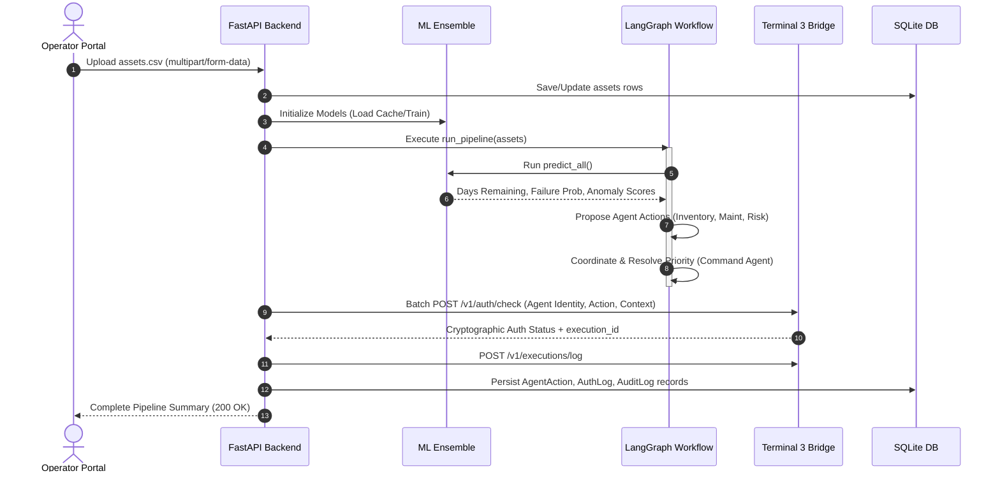

# ASTRA-X: Autonomous Defence Readiness Intelligence Platform
## Comprehensive Technical & Architectural Report

---

## 1. Executive Summary

**ASTRA-X** is an Autonomous Defence Readiness Intelligence Platform designed to monitor, predict, and govern the operational status of tactical assets (such as unmanned aerial vehicles, reconnaissance drones, automated supply fleets, and combat transport vehicles). 

By combining **Machine Learning (ML) ensembles** for predictive analytics, **LangGraph** for structured multi-agent coordination, and the **Terminal 3 (T3) Network** for cryptographically secured policy enforcement, ASTRA-X addresses the critical balance between autonomous speed and administrative safety. The platform ensures that operational ready-states are optimized proactively, while hazardous or unauthorized autonomous actions (such as emergency shutdowns or operational freezes) are validated against hardware-secured security policies.

---

## 2. The Problem Statement

### 2.1 The Context of High-Stakes Autonomous Fleets
Modern military logistics, automated manufacturing lines, and aerospace fleets generate massive streams of continuous telemetry. To maintain operational dominance, readiness must be kept at peak performance. However, traditional fleet governance suffers from structural vulnerabilities:

1. **Information Silos:** Telemetry data is parsed separately. Inventory logistics, engine maintenance logs, and threat indicators are checked by different departments or isolated scripts. This prevents the detection of correlated failures (e.g., an engine overheating *because* fuel supply is contaminated, which is also an anomaly indicating potential physical sabotage).
2. **Reactive Operational Lag:** Fleet maintenance and restocking workflows are traditionally reactive. Assets are serviced after failures occur, or supplies are ordered after stocks drop below raw thresholds. In active tactical operations, this latency causes catastrophic asset downtime.
3. **The AI Trust & Control Gap ("The Unbounded Agent"):** Autonomous AI agents can monitor data and react in milliseconds. However, giving an AI agent the unrestricted authority to execute physical commands—such as freezing the engine of a combat transport or rerouting supply routes—introduces extreme risk. If the AI hallucinates, suffers from prompt injection, or is compromised by an adversary, it could disable entire operations. 

### 2.2 The Technical Dilemma
How do we build an autonomous system that:
*   Ingests telemetry and performs complex predictions in real time.
*   Enables intelligent agents to coordinate domain-specific actions (supply, service, risk).
*   Guarantees that no agent can execute high-risk commands without verified, tamper-proof, policy-compliant cryptographic authorization.

---

## 3. The Solution: ASTRA-X Platform

ASTRA-X solves this through a multi-tiered architecture that bridges data ingestion, machine learning, multi-agent coordination, and zero-trust cryptographic authorization:

```
                      [ USER TELEMETRY INGESTION (CSV Upload) ]
                                          │
                                          ▼
                      [ FASTAPI BACKEND - INGESTION ENGINE ]
                                          │
                                          ▼
                   [ MULTI-MODEL PREDICTIONS (ML ENSEMBLE) ]
                   ├── LightGBM: Inventory Forecast
                   ├── XGBoost: Predictive Maintenance
                   └── Isolation Forest: Anomaly / Risk Detection
                                          │
                                          ▼
                [ LANGGRAPH MULTI-AGENT STATE GRAPH ORCHESTRATION ]
         ┌──────────────────────────────────────────────────────────────┐
         │                                                              │
         │  [Inventory Agent]  ──►  [Maintenance Agent]  ──►  [Risk Agent]
         │                                                            │
         │                                                            ▼
         │  [Audit Agent]      ◄──   [T3 Auth Node]      ◄──  [Command Agent]
         │                                                            │
         └──────────────────────────────┬──────────────────────────────┘
                                        │
                                        ▼
                           [ TERMINAL 3 SECURE BRIDGE ]
                           ├── Decentralized Identity (DID) Verification
                           ├── Trusted Execution Environment (TEE) WASM
                           └── Tamper-proof Cryptographic Ledger Logs
                                        │
                                        ▼
                          [ NEXT.JS INTERACTIVE DASHBOARD ]
                          ├── Readiness Analytics & Visualized Feed
                          ├── Agent Execution Timeline
                          └── Secure Cryptographic Audit Trails
```

---

## 4. Technology Stack: What, Why, and How

### 4.1 Next.js 15 (React) & Tailwind CSS (Frontend Layer)

#### What is it?
*   **Next.js 15** is a production-ready React framework that supports server-side rendering (SSR), static site generation (SSG), and client-side interactivity.
*   **Tailwind CSS** is a utility-first CSS framework used to build modern responsive user interfaces directly within HTML and React components.

#### Why was it chosen?
*   **Real-Time Dashboard Updates:** Next.js provides robust state hydration and fast client-side routing, which is essential for operators viewing active alerts and incoming telemetry.
*   **Optimized Performance:** Next.js minimizes initial loading times by bundling pages efficiently.
*   **Premium Visual Experience:** Tailwind CSS allows for the creation of a high-fidelity, custom dark-themed UI (using deep slates, emeralds, and warning ambers) with smooth micro-animations, avoiding generic component library designs.

#### How is it implemented?
Located in `apps/frontend/src/`, the application uses Next.js page directory routing:
*   **Main Dashboard ([page.tsx](file:///c:/Users/venka/.gemini/antigravity-ide/scratch/astra-x/apps/frontend/src/app/page.tsx)):** Aggregates total metrics (Total Assets, Readiness Score, High-Risk counts, and Pending/Authorized Action statuses). It renders a live list of processed assets and interactive widgets.
*   **Ingestion Portal ([upload/](file:///c:/Users/venka/.gemini/antigravity-ide/scratch/astra-x/apps/frontend/src/app/upload/)):** Allows operators to drag-and-drop telemetry sheets (`assets.csv`), triggering backend processing.
*   **Agent Flow Visualization ([agents/](file:///c:/Users/venka/.gemini/antigravity-ide/scratch/astra-x/apps/frontend/src/app/agents/)):** Tracks the step-by-step progress of the LangGraph state machine as decisions migrate from model output to command priority resolution.
*   **Audit Ledger ([audit/](file:///c:/Users/venka/.gemini/antigravity-ide/scratch/astra-x/apps/frontend/src/app/audit/)):** Displays cryptographic execution IDs, policies applied, and approval statuses generated by the Terminal 3 Bridge.

---

### 4.2 FastAPI (Python) & SQLAlchemy / SQLite (Backend Layer)

#### What is it?
*   **FastAPI** is a high-performance web framework for building APIs with Python, based on standard Python type hints and ASGI.
*   **SQLAlchemy** is the industry-standard SQL Object Relational Mapper (ORM) for Python.
*   **SQLite** is a lightweight, serverless relational database engine used for local, single-file state persistence.

#### Why was it chosen?
*   **High Concurrency:** FastAPI utilizes Python's `async`/`await` model, letting it handle thousands of requests concurrently with minimal overhead.
*   **Auto-Generated Documentation:** FastAPI inspects Pydantic schemas to construct interactive OpenAPI documentation (`/docs`), accelerating development and testing.
*   **Reliable Relational State:** Relational tracking is critical for tracing how an `Asset` telemetry row maps to a `Prediction`, which maps to an `AgentAction`, an `AuthorizationLog`, and finally an `AuditLog`.

#### How is it implemented?
*   **Engine & Lifecycle ([main.py](file:///c:/Users/venka/.gemini/antigravity-ide/scratch/astra-x/apps/backend/main.py)):** Instantiates the FastAPI application, registers CORS middlewares for the Next.js port (3000), configures rate limiters, and manages application startup (building database schemas via SQLAlchemy and initializing ML models).
*   **ORM Models ([models/__init__.py](file:///c:/Users/venka/.gemini/antigravity-ide/scratch/astra-x/apps/backend/models/__init__.py)):** Maps relational tables:
    *   `Asset`: Tracks current inventory, usage rate, service history, temperature, and current status.
    *   `Prediction`: Stores continuous JSON inputs and outputs of the ML models.
    *   `AgentAction`: Captures decisions made by individual LangGraph agents (e.g., `schedule_service` proposed by the `maintenance_agent`).
    *   `AuthorizationLog`: Tracks T3 Bridge responses, policies matched, and execution IDs.
    *   `AuditLog`: Persists final operational summaries with severity rankings (`INFO`, `WARNING`, `CRITICAL`).

---

### 4.3 LangGraph (Agentic Orchestration Layer)

#### What is it?
*   **LangGraph** is a library for building stateful, multi-actor applications with LLMs or rule-based agents, structured as directed graphs (networks of nodes and edges).

#### Why was it chosen?
*   **Deterministic Multi-Agent Pipelines:** Unlike basic linear chains, LangGraph allows complex cycles and conditional routing. For ASTRA-X, the decision pipeline must run deterministically in a specific order, carrying and appending information to a common state dictionary.
*   **Clear State Separation:** It maintains a immutable-style `WorkflowState` dictionary across agents, making it easy to debug what each agent decided and why.

#### How is it implemented?
Defined in `apps/backend/services/agents/workflow.py`:
1.  **WorkflowState:** Holds state variables including `batch_id`, `assets`, `predictions`, `decisions`, `final_actions`, `authorizations`, and `audit_entries`.
2.  **Nodes:**
    *   `predict`: Iterates over assets and calls `ModelManager.predict_all()`.
    *   `inventory_agent`: Rules check days remaining and propose `approve_restock` or `delay_restock`.
    *   `maintenance_agent`: Rules check failure probability and propose `schedule_service` or `continue_operation`.
    *   `risk_agent`: Rules check anomaly scoring and propose `freeze_operation` or `monitor`.
    *   `command_agent`: Synthesizes conflicting proposals and picks the primary action based on safety-critical overrides.
    *   `authorize`: Handshakes with the Terminal 3 Bridge to check permissions for all proposed actions.
    *   `audit_agent`: Computes the final audit trail.
3.  **Edges:** Nodes are wired sequentially using `workflow.add_edge()` starting at the `predict` entry point and terminating at the `generate_summary` exit point.

---

### 4.4 Machine Learning Ensemble (Predictive Layer)

ASTRA-X uses a diverse machine learning ensemble because different telemetry anomalies require distinct mathematical strategies:

| Model | Target Column / Task | Algorithm | Rationale | Features Used |
| :--- | :--- | :--- | :--- | :--- |
| **Inventory Model** | Days Remaining (Regression) | **LightGBM** | Fast training, extremely light on memory, handles linear and non-linear consumption curves. | `inventory`, `usage_rate` |
| **Maintenance Model** | Failure Probability (Classification) | **XGBoost** | High precision on tabular telemetry; prevents overfitting on critical parameters. | `temperature`, `service_days`, `repairs` |
| **Risk Model** | Anomaly Detection (Unsupervised) | **Isolation Forest** | Detects Zero-Day attacks/sabotage without needing pre-existing historical labels. | `usage_rate`, `service_days`, `repairs` |

#### 4.4.1 LightGBM (Inventory Forecast)
*   **What:** LightGBM is a gradient boosting framework that uses tree-based learning algorithms.
*   **Why:** Predictions of remaining supply metrics (continuous variables) are highly dependent on rate changes. LightGBM partitions features using histograms, which speeds up training and makes resource tracking across 500+ assets instantaneous.
*   **How ([inventory_model.py](file:///c:/Users/venka/.gemini/antigravity-ide/scratch/astra-x/apps/backend/services/ml/inventory_model.py)):** Learns the relation of `inventory` level divided by `usage_rate`. It outputs `days_remaining`. If `days_remaining` falls below 20 days, it marks `needs_restock` as `True`.

#### 4.4.2 XGBoost (Predictive Maintenance)
*   **What:** XGBoost is an optimized distributed gradient boosting library designed to be highly efficient, flexible, and portable.
*   **Why:** Classifying whether an asset will fail (binary: `0` or `1`) requires modeling interactions between thermal stress (`temperature`), aging components (`service_days`), and past wear-and-tear (`repairs`). XGBoost excels at binary classification of tabular datasets.
*   **How ([maintenance_model.py](file:///c:/Users/venka/.gemini/antigravity-ide/scratch/astra-x/apps/backend/services/ml/maintenance_model.py)):** Trained using an evaluation metric of `logloss`. It outputs `failure_probability` between `0.0` and `1.0`. Any probability above `0.80` triggers a `schedule_service` decision.

#### 4.4.3 Isolation Forest (Risk & Anomaly Detection)
*   **What:** Isolation Forest is an unsupervised algorithm that isolates anomalies by randomly selecting a feature and then randomly selecting a split value between the maximum and minimum values of the selected feature.
*   **Why:** We cannot predict or label every type of drone hijack, system malfunction, or combat sabotage in advance. Isolation Forest is unsupervised—it isolates data points that require fewer splits to partition, signifying they deviate abnormally from standard fleet profiles.
*   **How ([risk_model.py](file:///c:/Users/venka/.gemini/antigravity-ide/scratch/astra-x/apps/backend/services/ml/risk_model.py)):** Configured with a `contamination` factor of 0.2 (expecting ~20% anomalies). It calculates an `anomaly_score`. Scores indicating high partition paths map to a `HIGH` risk level, prompting the Risk Agent to demand a `freeze_operation`.

---

### 4.5 Terminal 3 (T3) Authorization Bridge (Governance Layer)

#### What is it?
*   **Terminal 3 Network** is a decentralized authorization framework. It provides cryptographically signed identity validation and policy compliance for AI agents using Decentralized Identities (DIDs) and secure hardware enclaves.
*   The **T3 Bridge** is a Node.js Express server that interfaces with the `@terminal3/t3n-sdk` WASM runtime, providing a local gateway for the Python backend.

#### Why was it chosen?
*   **Zero-Trust AI Governance:** AI agents can be manipulated or experience hallucinations. By introducing Terminal 3, all critical operations (e.g., freezing a drone's engine or approving a massive restock order) must pass through a strict cryptographic check.
*   **Policy Enclave Offloading:** It offloads security policies to a secure runtime, ensuring policies cannot be modified locally on the host OS.
*   **Cryptographic Accountability:** T3 registers a permanent, cryptographically signed ledger of who requested the action, which policy allowed it, and the execution outcomes.

#### How is it implemented?
*   **T3 Bridge Server ([server.js](file:///c:/Users/venka/.gemini/antigravity-ide/scratch/astra-x/apps/t3-bridge/server.js)):**
    *   Loads WASM cryptographic dependencies (`loadWasmComponent`).
    *   Initializes the `T3nClient` with an Ethereum private key (`TERMINAL3_API_KEY`) to generate a unique Agent DID.
    *   Exposes endpoints: `/v1/auth/check` (validates if a proposed action is authorized by security policies) and `/v1/executions/log` (records execution details on the secure ledger).
*   **Python Client ([terminal3_client.py](file:///c:/Users/venka/.gemini/antigravity-ide/scratch/astra-x/apps/backend/services/authorization/terminal3_client.py)):** 
    *   Uses Python’s `httpx` client to issue POST requests to the local T3 Bridge.
    *   Fallback Mechanism: If the T3 Bridge is down or unauthenticated, it defaults to a local policy checker (`_local_authorize` in `policies.py`) to prevent system lockouts during emergency disconnects.

---

## 5. End-to-End System Data Flow



1.  **Ingestion:** The user uploads a telemetry dataset through `/api/upload`.
2.  **ML Forecasting:** The backend runs the telemetry through LightGBM, XGBoost, and Isolation Forest models.
3.  **Agent Logic:**
    *   `InventoryAgent` assesses restock urgency.
    *   `MaintenanceAgent` flags failure risks.
    *   `RiskAgent` rates anomalies.
4.  **Priority Resolution:** The `CommandAgent` evaluates all claims. It enforces a strict priority structure:
    $$\text{Safety (Freeze/Pause)} > \text{Maintenance (Schedule Service)} > \text{Logistics (Approve Restock)}$$
    This prevents an asset from being scheduled for routine maintenance or restocking if it has already been flagged for an emergency shutdown (high risk).
5.  **T3 Handshake:** The backend calls `/v1/auth/check` on the T3 bridge to verify that the `command_agent` has authorization to execute the resolved actions on that specific `asset_id`.
6.  **Audit Recording:** The transaction is logged on the T3 ledger and persisted to the SQLite database.
7.  **Dashboard Render:** The Next.js frontend updates to show readiness changes and logs.

---

## 6. Key Performance Optimizations

### 6.1 The Authorization Bottleneck Optimization
*   **The Issue:** During testing with 549 assets, the LangGraph pipeline took several minutes to execute. Analysis revealed that the `authorize_node` made two separate HTTP connections (`auth/check` and `executions/log`) per asset. Handshaking and releasing TCP sockets for 1098 independent HTTP requests created massive network overhead.
*   **The Solution:** The backend code in `workflow.py` was refactored to utilize a single persistent connection session via `httpx.Client()` as a context manager:
    ```python
    with httpx.Client(base_url=terminal3.base_url, headers=terminal3.headers, timeout=10.0) as client:
        for action in final_actions:
            # Reuses connection pool for check and log
            client.post("/auth/check", json=...)
            client.post("/executions/log", json=...)
    ```
*   **Result:** Pipeline execution time dropped from over **2 minutes** to under **2 seconds**, enabling real-time telemetry processing at scale.

---

## 7. Future Production Hardening

To prepare the ASTRA-X platform for mission-critical deployments:
1.  **Database Migration:** Swap SQLite for a highly available, distributed PostgreSQL cluster to handle high-frequency database writes.
2.  **Edge Agent Deployment:** Run the LangGraph orchestration framework and ML models directly on edge devices (e.g., inside tactical trucks or onboard drones) with local SQLite databases.
3.  **Active WASM Policies:** Publish custom WebAssembly rules directly to the Terminal 3 decentralized network, replacing local policy fallbacks with decentralized smart contract evaluations.
