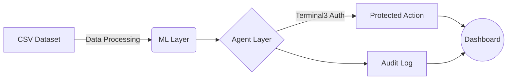
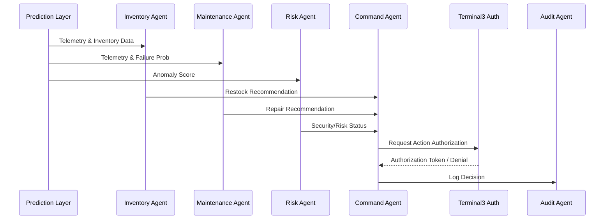

<div align="center">
  

  <h1>🛡️ ASTRA-X</h1>
  
  <p><strong>Autonomous Defence Readiness Intelligence Platform</strong></p>

  <p>
    
    
    
    
    
  </p>
</div>

---

> ⚠️ **IMPORTANT**: This platform focuses **exclusively** on logistics readiness and asset governance. No weapon systems, targeting, surveillance, or combat tooling is implemented.

ASTRA-X is a multi-agent ML-driven logistics readiness and asset governance platform. It demonstrates state-of-the-art ML prediction, agent orchestration, decentralized identity verification (Terminal3 authorization), protected automated actions, comprehensive auditability, and beautiful dashboard visualizations.

---

## 🏗️ Architecture



### 🧠 ML Models
| Model | Algorithm | Inputs | Output |
|-------|-----------|--------|--------|
| **Inventory Forecast** | LightGBM | `inventory`, `usage_rate` | `days_remaining` |
| **Predictive Maintenance** | XGBoost | `temperature`, `service_days`, `repairs` | `failure_probability` |
| **Risk Detection** | Isolation Forest | `usage_rate`, `service_days`, `repairs` | `risk level (HIGH/MEDIUM/LOW)` |

### 🤖 Agent Pipeline (LangGraph)


---

## 💻 Tech Stack

- **Frontend**: Next.js 15, TypeScript, Tailwind CSS, shadcn/ui, React Query, Zustand
- **Backend**: FastAPI, SQLAlchemy, Pandas, LangGraph
- **ML**: LightGBM, XGBoost, scikit-learn
- **Database**: SQLite (dev) / PostgreSQL (prod)
- **Deployment**: Render (free tier)

---

## 🚀 Quick Start

### Prerequisites
- Python 3.11+
- Node.js 18+
- npm

### ⚙️ Backend Setup
```bash
cd apps/backend
pip install -r requirements.txt
# Copy env file
cp ../../infra/.env.example .env
# Seed database
python seed.py
# Start server
uvicorn main:app --reload --port 8000
```

### 🖥️ Frontend Setup
```bash
cd apps/frontend
npm install
# Set API URL
echo "NEXT_PUBLIC_API_URL=http://localhost:8000" > .env.local
npm run dev
```

### 🎯 Demo Flow
1. Open [http://localhost:3000](http://localhost:3000)
2. Navigate to **Upload**
3. Upload `data/assets.csv`
4. Click **Run Agent Pipeline**
5. View results on **Dashboard**, **Agents**, **Readiness**, and **Audit** pages

*Expected result for `TRUCK002`:*
- Failure Probability: **91%**
- Action: **schedule_service**
- Authorized: **TRUE**

---

## 🔌 API Endpoints

| Method | Endpoint | Description |
|--------|----------|-------------|
| `GET` | `/health` | Health check |
| `GET` | `/` | API info |
| `POST` | `/upload` | CSV upload + validation |
| `POST` | `/predict` | Batch predictions |
| `POST` | `/predict/inventory` | Inventory forecast |
| `POST` | `/predict/maintenance` | Maintenance prediction |
| `POST` | `/predict/risk` | Risk detection |
| `POST` | `/agent/run` | Run full agent pipeline |
| `POST` | `/authorize` | Terminal3 authorization |
| `GET` | `/dashboard` | Aggregated dashboard data |
| `GET` | `/audit` | Audit log feed |
| `GET` | `/assets` | Asset listing |

Interactive docs available at: [http://localhost:8000/docs](http://localhost:8000/docs)

---

## 📂 Project Structure

```text
astra-x/
├── apps/
│   ├── frontend/              # Next.js 15 App Router
│   │   └── src/
│   │       ├── app/           # Pages (dashboard, upload, assets, agents, readiness, audit)
│   │       ├── components/    # UI components (shadcn + custom)
│   │       ├── lib/           # API client, Zustand store, React Query hooks
│   │       └── types/         # TypeScript definitions
│   └── backend/               # FastAPI monolith
│       ├── api/               # Route handlers
│       ├── models/            # SQLAlchemy ORM
│       ├── schemas/           # Pydantic schemas
│       ├── services/
│       │   ├── ml/            # LightGBM, XGBoost, Isolation Forest
│       │   ├── agents/        # LangGraph workflow + 5 agents
│       │   └── authorization/ # Terminal3 mock adapter
│       ├── db/                # Database engine
│       └── utils/             # Data processing
├── data/                      # Seed CSV dataset
├── infra/                     # render.yaml, .env.example
└── docs/                      # Documentation
```

---

## ☁️ Deployment (Render)

1. Push to GitHub
2. Create a new **Blueprint** on Render
3. Point to `infra/render.yaml`
4. Render provisions: Backend (web service), Frontend (static site), PostgreSQL

See `docs/deployment-guide.md` for details.

---

## 📜 License

This project is licensed under the **Apache License 2.0**. See the [LICENSE](./LICENSE) file for details.
