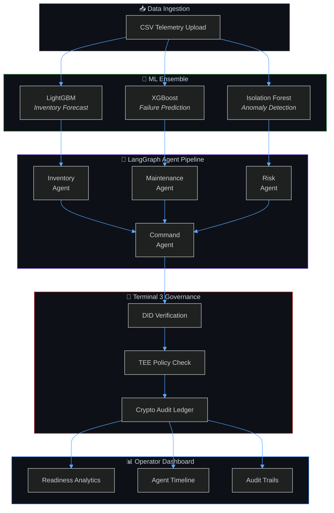
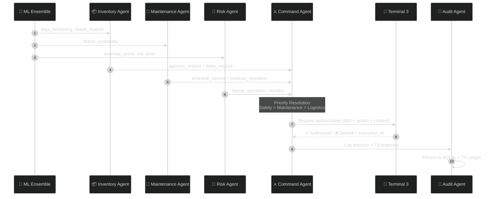
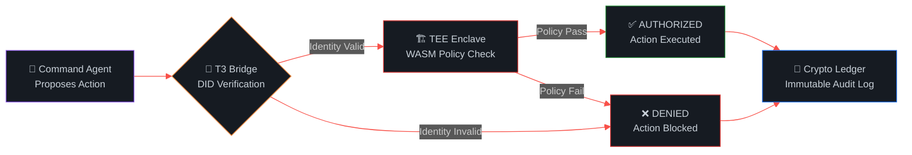

<div align="center">

<!-- ═══════════════════════════════════════════════════════════════════════ -->
<!--                          ASTRA-X  ·  HEADER                          -->
<!-- ═══════════════════════════════════════════════════════════════════════ -->


<br/>

<a href="#-architecture"></a>&nbsp;
<a href="#-ml-ensemble"></a>&nbsp;
<a href="#-agent-pipeline"></a>&nbsp;
<a href="#-terminal-3-zero-trust-governance"></a>&nbsp;
<a href="#-quick-start"></a>

<br/><br/>


<br/><br/>

> **Multi-agent ML-driven logistics readiness & asset governance platform.**<br/>
> ML prediction · Agent orchestration · Decentralized identity verification · Cryptographic audit trails

</div>

<br/>

> [!WARNING]
> This platform focuses **exclusively** on logistics readiness and asset governance. **No weapon systems, targeting, surveillance, or combat tooling** is implemented.

---

## 🎯 What is ASTRA-X?

ASTRA-X is an **AI-driven, multi-agent platform** that automates defense fleet readiness and asset governance. It continuously monitors synthetic telemetry data from assets and uses specialized Machine Learning models to predict failures, supply shortages, and security anomalies — then coordinates intelligent agents to take **cryptographically authorized** protective actions.

<table>
<tr>
<td width="33%" align="center">

### ⚡ The Problem

Reactive maintenance, data overload across thousands of telemetry streams, and the dangerous gap between AI speed and human oversight.

</td>
<td width="33%" align="center">

### 🧠 The Solution

Three specialized ML models feed a coordinated agent pipeline that proposes, validates, and executes protective actions.

</td>
<td width="33%" align="center">

### 🔐 The Safeguard

Terminal 3's decentralized identity & TEE-backed policies ensure no AI agent can execute critical commands without cryptographic authorization.

</td>
</tr>
</table>

---

## 🏗️ Architecture



---

## 🧠 ML Ensemble

ASTRA-X uses a **diverse ML ensemble** because different telemetry anomalies require distinct mathematical strategies:

<table>
<tr>
<td align="center" width="33%">

### 📦 Inventory Forecast

<br/><br/>

**Algorithm:** LightGBM<br/>
**Task:** Predict `days_remaining`<br/>
**Features:** `inventory`, `usage_rate`<br/>
**Threshold:** < 20 days → `needs_restock`

<br/>

> *Histogram-based gradient boosting for fast, memory-efficient consumption curve modeling across 500+ assets.*

</td>
<td align="center" width="33%">

### 🔧 Predictive Maintenance

<br/><br/>

**Algorithm:** XGBoost<br/>
**Task:** Predict `failure_probability`<br/>
**Features:** `temperature`, `service_days`, `repairs`<br/>
**Threshold:** > 0.80 → `schedule_service`

<br/>

> *Gold-standard tabular classification detecting nonlinear interactions between thermal stress, aging, and wear-and-tear.*

</td>
<td align="center" width="33%">

### 🚨 Risk & Anomaly Detection

<br/><br/>

**Algorithm:** Isolation Forest<br/>
**Task:** Detect anomalies (zero-day)<br/>
**Features:** `usage_rate`, `service_days`, `repairs`<br/>
**Output:** `HIGH` / `MEDIUM` / `LOW`

<br/>

> *Unsupervised anomaly isolation — detects threats without needing historical attack labels.*

</td>
</tr>
</table>

---

## 🤖 Agent Pipeline

The LangGraph-powered multi-agent workflow coordinates domain-specific agents through a deterministic state graph:



<details>
<summary><b>🔍 Agent Decision Priority Matrix</b></summary>
<br/>

The **Command Agent** resolves conflicting recommendations using a strict safety-first priority:

```
Safety (freeze_operation)  >  Maintenance (schedule_service)  >  Logistics (approve_restock)
```

| Scenario | Inventory Agent | Maintenance Agent | Risk Agent | **Command Decision** |
|----------|:-:|:-:|:-:|:-:|
| Normal ops | `delay_restock` | `continue_operation` | `monitor` | **`continue_operation`** |
| Low supplies | `approve_restock` | `continue_operation` | `monitor` | **`approve_restock`** |
| Engine failing | `delay_restock` | `schedule_service` | `monitor` | **`schedule_service`** |
| Anomaly detected | `approve_restock` | `schedule_service` | `freeze_operation` | **`freeze_operation`** ⚠️ |

</details>

---

## 🔐 Terminal 3 — Zero-Trust Governance

> *"Even if the AI goes rogue, Terminal 3's cryptographic policies block the action."*



<table>
<tr>
<td width="50%">

**🔑 How It Works**

1. Agent is assigned an **Ethereum-based DID**
2. Before executing `freeze_operation`, agent handshakes with the **T3 Bridge**
3. T3 checks a **tamper-proof WASM contract** in a secure enclave
4. Only if the agent is authorized for *this action* on *this asset* does execution proceed
5. Every decision is logged to an **immutable cryptographic ledger**

</td>
<td width="50%">

**🛡️ Why It Matters**

| Threat | T3 Response |
|--------|-------------|
| AI hallucination | Policy blocks unauthorized action |
| Prompt injection attack | DID verification fails |
| Compromised agent | TEE enclave rejects tampered identity |
| Insider manipulation | Immutable ledger preserves evidence |

</td>
</tr>
</table>

---

## 💻 Tech Stack

<table>
<tr>
<td align="center" width="20%"><b>Frontend</b></td>
<td align="center" width="20%"><b>Backend</b></td>
<td align="center" width="20%"><b>ML / AI</b></td>
<td align="center" width="20%"><b>Database</b></td>
<td align="center" width="20%"><b>Security</b></td>
</tr>
<tr>
<td align="center">
  <br/>
  <br/>
  <br/>
  <br/>
  
</td>
<td align="center">
  <br/>
  <br/>
  <br/>
  <br/>
  
</td>
<td align="center">
  <br/>
  <br/>
  <br/>
  
</td>
<td align="center">
  <br/>
  
</td>
<td align="center">
  <br/>
  <br/>
  
</td>
</tr>
</table>

---

## 🚀 Quick Start

<details open>
<summary><b>⚙️ Prerequisites</b></summary>
<br/>

| Tool | Version |
|------|---------|
| Python | `3.11+` |
| Node.js | `18+` |
| npm | Latest |

</details>

<details open>
<summary><b>🔧 Backend Setup</b></summary>

```bash
cd apps/backend
pip install -r requirements.txt

# Copy environment config
cp ../../infra/.env.example .env

# Seed the database
python seed.py

# Start the server
uvicorn main:app --reload --port 8000
```

</details>

<details open>
<summary><b>🖥️ Frontend Setup</b></summary>

```bash
cd apps/frontend
npm install

# Configure API endpoint
echo "NEXT_PUBLIC_API_URL=http://localhost:8000" > .env.local

# Launch dev server
npm run dev
```

</details>

<details>
<summary><b>🎯 Demo Walkthrough</b></summary>
<br/>

| Step | Action |
|:----:|--------|
| **1** | Open [http://localhost:3000](http://localhost:3000) |
| **2** | Navigate to **Upload** |
| **3** | Upload `data/assets.csv` |
| **4** | Click **Run Agent Pipeline** |
| **5** | Explore **Dashboard**, **Agents**, **Readiness**, and **Audit** pages |

**Expected result for `TRUCK002`:**

| Metric | Value |
|--------|-------|
| Failure Probability | **91%** |
| Command Action | `schedule_service` |
| T3 Authorized | ✅ `TRUE` |

</details>

---

## 🔌 API Reference

<details>
<summary><b>📡 Endpoint Map</b></summary>
<br/>

| Method | Endpoint | Description |
|:------:|----------|-------------|
| `GET` | `/health` | Health check |
| `GET` | `/` | API metadata |
| `POST` | `/upload` | CSV upload + validation |
| `POST` | `/predict` | Batch ML predictions |
| `POST` | `/predict/inventory` | Inventory forecast only |
| `POST` | `/predict/maintenance` | Maintenance prediction only |
| `POST` | `/predict/risk` | Risk detection only |
| `POST` | `/agent/run` | Full agent pipeline execution |
| `POST` | `/authorize` | Terminal3 authorization check |
| `GET` | `/dashboard` | Aggregated dashboard data |
| `GET` | `/audit` | Audit log feed |
| `GET` | `/assets` | Asset listing |

> 📖 Interactive docs: [http://localhost:8000/docs](http://localhost:8000/docs)

</details>

---

## 📂 Project Structure

```text
astra-x/
│
├── 📱 apps/
│   ├── frontend/                  # Next.js 15 App Router
│   │   └── src/
│   │       ├── app/               # Pages: dashboard, upload, assets, agents, readiness, audit
│   │       ├── components/        # shadcn/ui + custom components
│   │       ├── lib/               # API client, Zustand store, React Query hooks
│   │       └── types/             # TypeScript definitions
│   │
│   ├── backend/                   # FastAPI monolith
│   │   ├── api/                   # Route handlers
│   │   ├── models/                # SQLAlchemy ORM models
│   │   ├── schemas/               # Pydantic validation schemas
│   │   ├── services/
│   │   │   ├── ml/                # LightGBM · XGBoost · Isolation Forest
│   │   │   ├── agents/            # LangGraph workflow + 5 agents
│   │   │   └── authorization/     # Terminal3 client + local policy fallback
│   │   ├── db/                    # Database engine & sessions
│   │   └── utils/                 # Data processing utilities
│   │
│   └── t3-bridge/                 # Terminal 3 Node.js bridge server
│       └── server.js              # WASM crypto + DID + TEE policy gateway
│
├── 📊 data/                       # Seed CSV dataset (assets.csv)
├── ⚙️ infra/                      # render.yaml, .env.example
├── 📚 docs/                       # Architecture docs, ERD, deployment guide
└── 📜 LICENSE                     # Apache License 2.0
```

---

## ⚡ Performance

<table>
<tr>
<td width="50%">

### 🔄 Authorization Bottleneck Fix

**Before:** 549 assets × 2 HTTP calls = **1,098 TCP handshakes** → **~2 min**

**After:** Persistent `httpx.Client()` connection pooling → **< 2 sec**

```python
# Connection reuse via context manager
with httpx.Client(base_url=t3.base_url) as client:
    for action in final_actions:
        client.post("/auth/check", json=payload)
        client.post("/executions/log", json=log)
```

</td>
<td width="50%">

### 📈 Result

```text
┌─────────────────────────────────┐
│  Pipeline Execution Time        │
│                                 │
│  Before:  ██████████████  120s  │
│  After:   █               1.8s │
│                                 │
│  Improvement:  ~66x faster 🚀  │
└─────────────────────────────────┘
```

</td>
</tr>
</table>

---

## ☁️ Deployment

<details>
<summary><b>🌐 Deploy to Render (Free Tier)</b></summary>
<br/>

1. Push to GitHub
2. Create a new **Blueprint** on [Render](https://render.com)
3. Point to `infra/render.yaml`
4. Render auto-provisions:
   - ✅ Backend (Web Service)
   - ✅ Frontend (Static Site)
   - ✅ PostgreSQL Database

> 📖 Full guide: [`docs/deployment-guide.md`](./docs/deployment-guide.md)

</details>

---

## 🗺️ Roadmap

| Phase | Feature | Status |
|:-----:|---------|:------:|
| 🟢 | ML ensemble (LightGBM + XGBoost + Isolation Forest) | ✅ Done |
| 🟢 | LangGraph multi-agent pipeline | ✅ Done |
| 🟢 | Terminal 3 zero-trust authorization | ✅ Done |
| 🟢 | Next.js 15 interactive dashboard | ✅ Done |
| 🟢 | Cryptographic audit trails | ✅ Done |
| 🟡 | PostgreSQL cluster for production | 🔜 Planned |
| 🟡 | Edge deployment (on-device ML) | 🔜 Planned |
| 🟡 | Active WASM policy publishing to T3 network | 🔜 Planned |

---

## 📜 License

This project is licensed under the **Apache License 2.0** — see the [LICENSE](./LICENSE) file for details.

---

<div align="center">


<sub>Built with 🛡️ by <a href="https://github.com/v3nom-95">v3nom-95</a></sub>

</div>
